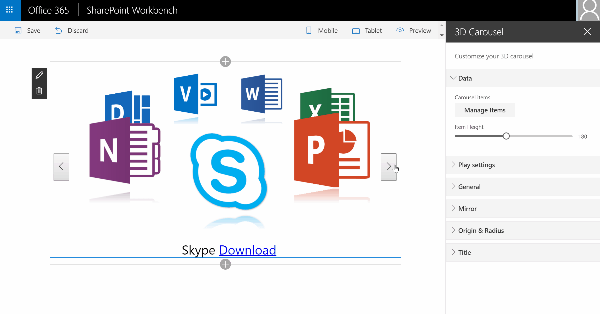

> Note: The SharePoint Framework is currently in preview and is subject to change. SharePoint Framework client-side web parts are not currently supported for use in production enviornments.

## 3D Carousel Web Part

The 3D Carousel Web Part is a SharePoint client side web part built with the SharePoint Framework (SPFx) in the preview version.
This web part adds a 3D carousel animation with picture, title and link.
This project uses the JQuery plugin [jquery.cloud9carousel.js](http://specious.github.io/cloud9carousel/ created by R. Cecco.
This web part uses also the [Custom Fields library](https://github.com/OlivierCC/spfx-custom-fields) to enhance the web part edition experience.

Thanks to this WP, you can insert your text, change the radius, the direction, the size, the font, etc.
Your title has now an awesome look.



## Features

You can manage the following settings:
* **Font**: specifies the font family as Arial, Verdana, etc.
* **Size**: sets the font size
* **Color**: sets the font color

## Run this web part in the SharePoint workbench

```bash
git clone the repo
npm i
tsd install
gulp serve
```

If you need more information about to develop SharePoint Framework client side web part, deploy and test it on your workbench
station, you can consult the following tutorial: https://github.com/SharePoint/sp-dev-docs/wiki/Setup-SharePoint-Tenant

## How to use it in the local or the SharePoint workbench

By compiling this code on a configured workstation, you can test this web part on your local SharePoint workbench
or on a developer site. Please follow the tutorials in the SPFx tutorial to know the process : https://github.com/SharePoint/sp-dev-docs/wiki/Setup-SharePoint-Tenant

##The MIT License (MIT)

Copyright (c) 2016 Olivier Carpentier

Permission is hereby granted, free of charge, to any person obtaining a copy of this software and associated documentation files (the "Software"), to deal in the Software without restriction, including without limitation the rights to use, copy, modify, merge, publish, distribute, sublicense, and/or sell copies of the Software, and to permit persons to whom the Software is furnished to do so, subject to the following conditions:

The above copyright notice and this permission notice shall be included in all copies or substantial portions of the Software.

THE SOFTWARE IS PROVIDED "AS IS", WITHOUT WARRANTY OF ANY KIND, EXPRESS OR IMPLIED, INCLUDING BUT NOT LIMITED TO THE WARRANTIES OF MERCHANTABILITY, FITNESS FOR A PARTICULAR PURPOSE AND NONINFRINGEMENT. IN NO EVENT SHALL THE AUTHORS OR COPYRIGHT HOLDERS BE LIABLE FOR ANY CLAIM, DAMAGES OR OTHER LIABILITY, WHETHER IN AN ACTION OF CONTRACT, TORT OR OTHERWISE, ARISING FROM, OUT OF OR IN CONNECTION WITH THE SOFTWARE OR THE USE OR OTHER DEALINGS IN THE SOFTWARE.
